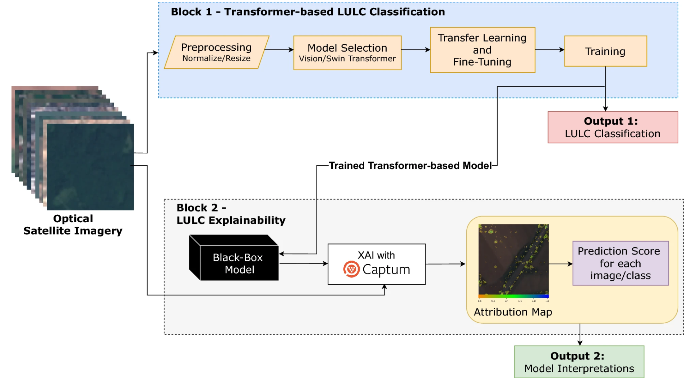
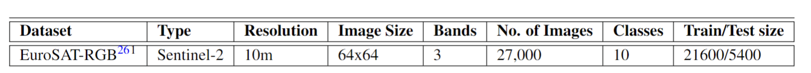
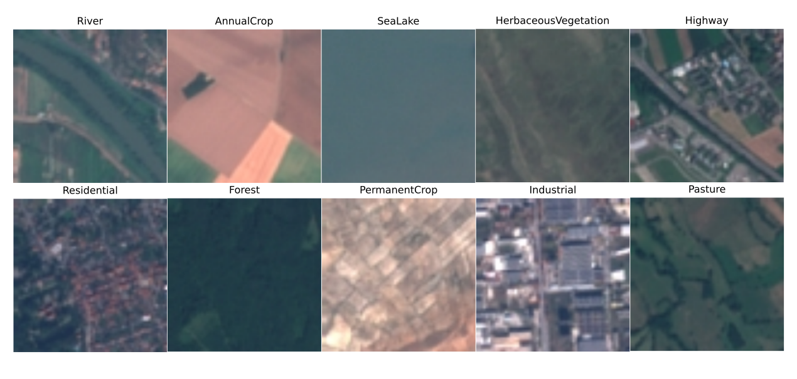
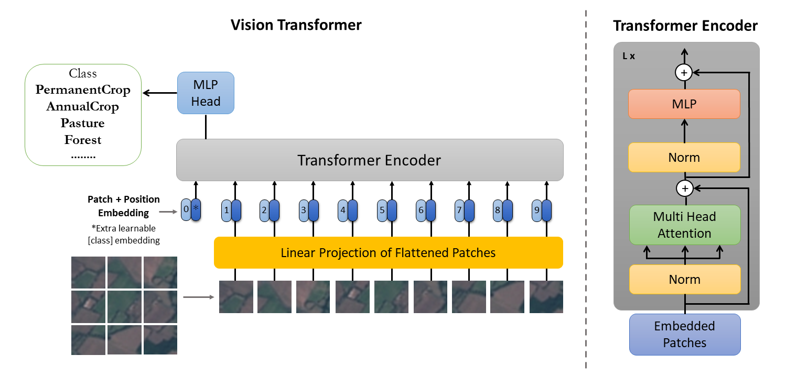
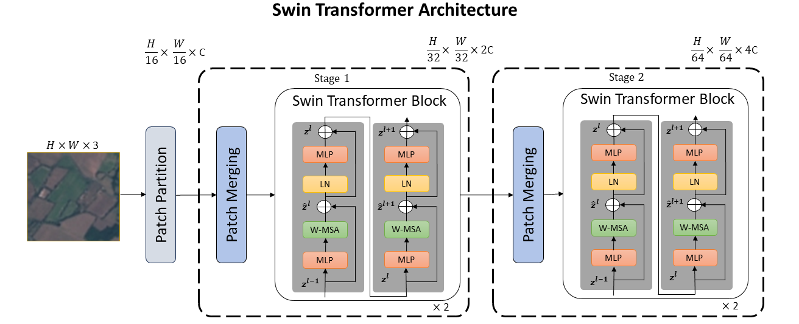

# **Transformer-based Land Use and Land Cover Classification with Explainability using Satellite Imagery**

This repository contains the code for our paper:  
📄 **[Transformer-based Land Use and Land Cover Classification with Explainability using Satellite Imagery](https://www.nature.com/articles/s41598-024-67186-4)**  
✍ **Authors:** Mehak Khan, Abdul Hanan, Meruyert Kenzhebay, Michele Gazzea & Reza Arghandeh  
📚 **Journal:** *Scientific Reports (Nature)*  

In this work, we introduce a **framework** that enhances the efficiency of **Vision Transformer (ViT) and Swin Transformer** models through **transfer learning** and **fine-tuning** techniques.  

Our approach also emphasizes **model interpretability**, ensuring that deep learning decisions in **Land Use and Land Cover (LULC) classification** are both **transparent and understandable**. This is particularly crucial for **forestry, agriculture, and environmental monitoring applications** using satellite imagery.

<p align="center">
  
</p>

---

## **📌 Key Features**
✔ **Transformer-based Deep Learning:** Fine-tuned **Vision Transformer (ViT)** and **Swin Transformer** models for satellite image classification.  
✔ **Explainability with Integrated Gradients:** We leverage **Captum’s Integrated Gradients** to provide interpretability in LULC classification.  
✔ **Efficient Training Pipeline:** Utilizes **transfer learning** and **fine-tuning** for improved performance.  
✔ **Application Areas:** Forestry, agricultural monitoring, environmental analysis, and urban planning.  

---

## **📂 Dataset**
We use the **[EuroSAT-RGB](https://github.com/phelber/EuroSAT)** dataset, which contains **RGB satellite images** across **ten different land use classes**. For further validation of our framework’s generalization and scalability, we conducted additional experiments using **[PatternNet](https://www-sciencedirect-com.galanga.hvl.no/science/article/pii/S0924271618300042)** dataset.

<p align="center">
  
</p>

Example images from EuroSAT:
<p align="center">
  
</p>

---

## **🧠 Models**
Our framework leverages two transformer-based models:

- **Vision Transformer (ViT)**
- **Swin Transformer**

<p align="center">
  
  
</p>


---

## **🔍 Explainability**
To ensure **model interpretability**, we integrate **Integrated Gradients** from the [Captum Library](https://captum.ai/). This allows us to **visualize feature importance** in the classification process.

---

## **📌 Acknowledgements**
- The **[EuroSAT](https://github.com/phelber/EuroSAT)** and **[PatternNet](https://www-sciencedirect-com.galanga.hvl.no/science/article/pii/S0924271618300042)** datasets are publicly available.
- We use **Vision Transformers (ViT)** and **Swin Transformers**, based on the **[Timm library](https://huggingface.co/timm)** library.
- Explainability is powered by the **[Captum Library](https://captum.ai/)**.

---

## **📬 Contact**
For questions or collaborations, feel free to open an issue or reach out!  

📧 Email: [mehakkhan3@hotmail.com](mailto:mehakkhan3@hotmail.com)  

---

## **📝 Citation**
If you find this work useful, please cite our paper:

```bibtex
@article{khan2024transformer,
  title={Transformer-based land use and land cover classification with explainability using satellite imagery},
  author={Khan, Mehak and Hanan, Abdul and Kenzhebay, Meruyert and Gazzea, Michele and Arghandeh, Reza},
  journal={Scientific Reports},
  volume={14},
  number={1},
  pages={16744},
  year={2024},
  publisher={Nature Publishing Group UK London}
}


