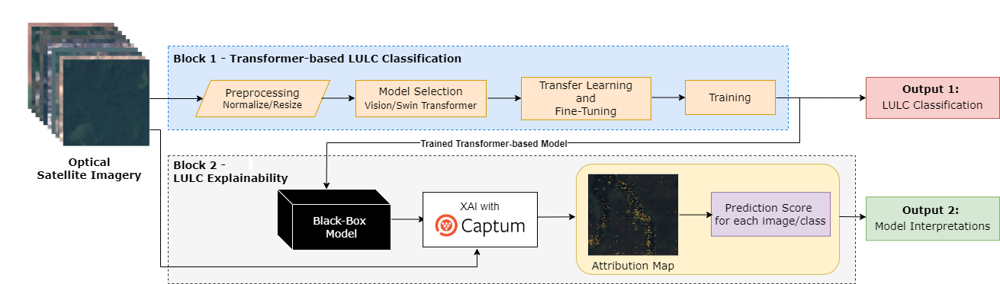

**The work is in progress**

## Transformer-based Land Use and Land Cover Classification with Explainability using Satellite Imagery

In this repository, we make the code built for our paper in which we introduce a framework designed to enhance the efficiency of Vision and Swin Transformer models by employing transfer learning and fine-tuning strategies. It also examines the significance of interpretability in these models, with a particular emphasis on Land Use and Land Cover (LULC) analysis using satellite imagery. The goal is to improve the performance of these advanced deep-learning models and ensure that their decision-making processes are transparent and understandable. This is a critical consideration for practical applications in LULC classification for areas such as forestry and various agricultural classifications.

## Data
The datasets used in this work are publicly available:
* [EuroSAT-RGB](https://github.com/phelber/EuroSAT)
  

  

## Models
* Vision Transformer and Swin Transformer

## Explainability 
We utilized Integrated Gradients from [Captum Library](https://captum.ai/) to integrate Explainability in our proposed framework.

## Training 
In order to run our framework, use this demo file: 

